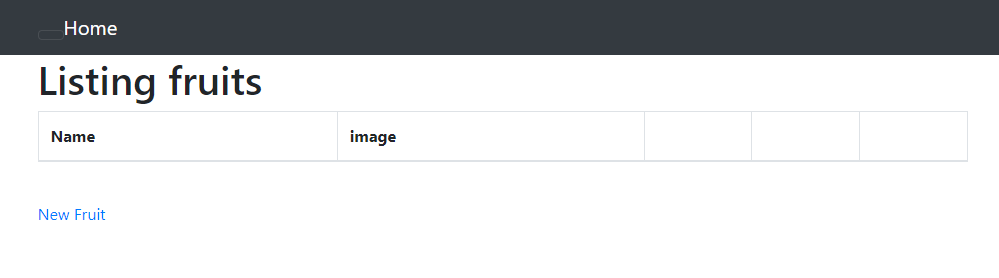
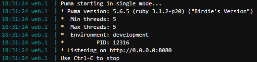
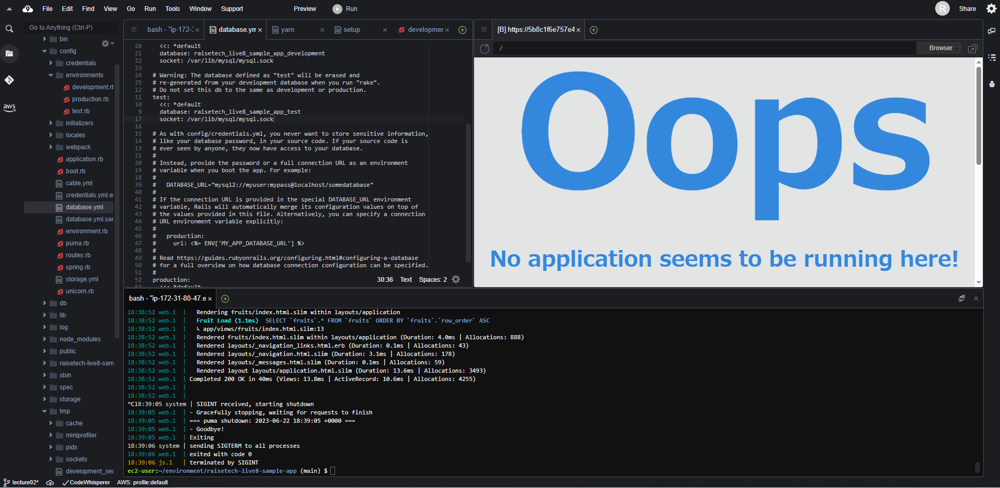
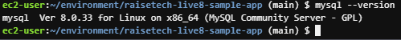
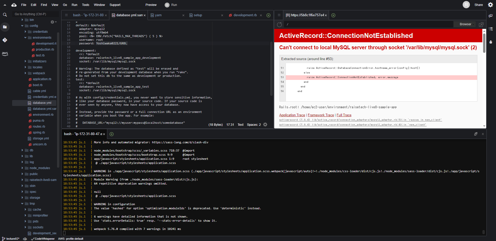
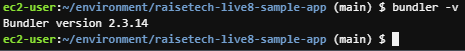

# 第3回課題
## サンプルアプリケーションの起動
- ブラウザで表示、起動確認

## APサーバーについて
- APサーバーの名前とバージョン

- APサーバー終了後、アクセスはできない

## DBサーバーについて
- DBサーバーの名前とバージョン

- DBサーバー終了後、アクセスするとエラーになる

## Railsの構成管理ツールの名前
- Railsの構成管理ツールの名前は「Bundler」という
- バージョンを確認

