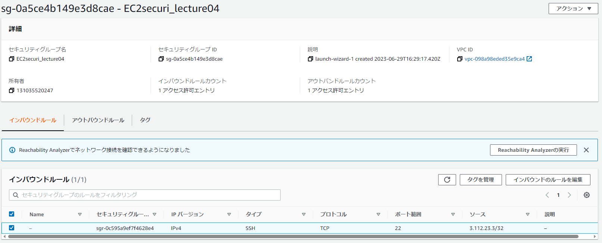
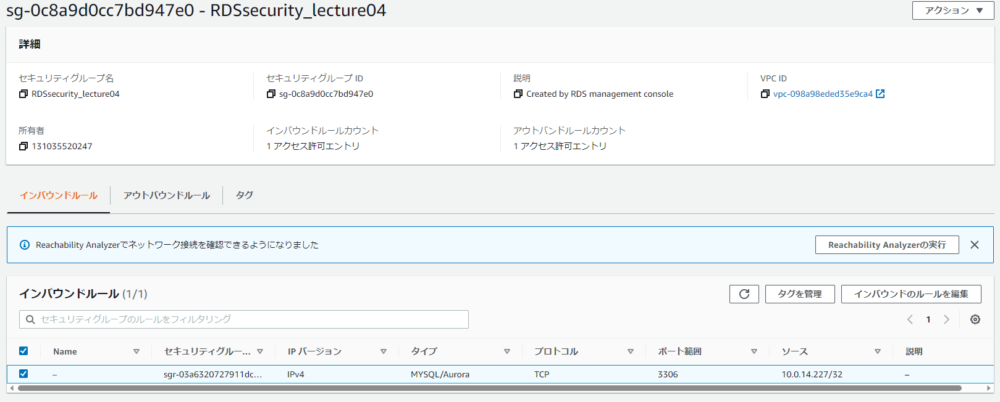

# 第4回課題
## VPCの作成
- AWS上にVPCが作成されていることを確認。

## EC2の構築
- 作成したVPC上にEC2が構築されていることを確認。

- EC2のセキュリティグループを確認。

## RDSの構築
- 作成したVPC上にRDSが構築されていることを確認。

- RDSのセキュリティグループを確認。

## EC2からRDSに接続する
- 接続が正常にできることを確認。

## その他の操作
- 接続確認後、EC2のセキュリティグループのソースが0.0.0.0/0となっており、セキュリティに問題があったためホストのIPアドレスへ変更した。
- RDSのセキュリティグループのソースも本来意図していたものとは違ったため、EC2インスタンスのIPアドレスへ変更した。

